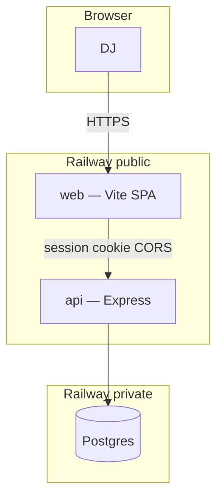

# Railway deployment

Postgres, API, and (optionally) the Vite SPA run on **Railway** (same split shape as [api-security](https://github.com/jantznick/api-security): API + DB on Railway; static web is a separate service — Railway Docker or [Render static](./RENDER.md)).

Platform URLs (`*.up.railway.app`) work until custom domains are attached.

**Full checklist:** [DEPLOY.md](./DEPLOY.md).

---

## Service map



| Service | Repo path | Dockerfile | Public? | Role |
| --- | --- | --- | --- | --- |
| Postgres | Railway plugin | — | No | Shared DB |
| api | `apps/api/` | `apps/api/Dockerfile` | Yes | Auth, sessions, Tidal OAuth, magic link |
| web | repo root (`src/`) | `apps/web/Dockerfile` | Yes | Vite SPA (`serve -s dist`) |

**Build context = repo root** for both Dockerfiles (Prisma + npm workspaces live at root).

---

## Env matrix

| Variable | Service | Notes |
| --- | --- | --- |
| `DATABASE_URL` | api | From Railway Postgres plugin (reference variable) |
| `SESSION_SECRET` | api | Long random string (required) |
| `FRONTEND_URLS` | api | Web origin(s) for CORS, e.g. `https://<web>.up.railway.app` |
| `FRONTEND_URL` | api | Optional single origin; magic-link + Tidal post-OAuth redirects use first allowlist entry |
| `COOKIE_DOMAIN` | api | **Leave unset** for host-only cookies on `api.*` (recommended). CORS failures are **not** fixed by this — set `FRONTEND_URLS` instead. |
| `NODE_ENV` | api, web | `production` |
| `PORT` | api, web | Railway injects; apps listen on it |
| `RESEND_API_KEY` | api | Required in production for magic-link email |
| `RESEND_FROM_EMAIL` | api | Verified sender, e.g. `Hercules <noreply@yourdomain.com>` |
| `TIDAL_CLIENT_ID` / `TIDAL_CLIENT_SECRET` | api | From [developer.tidal.com](https://developer.tidal.com/) |
| `TIDAL_REDIRECT_URI` | api | **API** HTTPS callback: `https://<api-public>/api/tidal/callback` (register the same URI in the Tidal app) |
| `TIDAL_COUNTRY_CODE` | api | Optional, default `US` |
| `TOKEN_ENCRYPTION_KEY` | api | Optional; defaults to `SESSION_SECRET` for Tidal token encryption |
| `VITE_API_URL` | **web build** | Public API origin (no trailing slash). Vite inlines at build time — changing it requires a **rebuild** |

Cookies in production: `secure` + `sameSite=none` + credentials CORS (see `apps/api/src/lib/sessionCookie.ts`).

---

## Deploy order

### 0. Prerequisites

- Railway account + repo on GitHub (or Railway connected to this repo)
- [Railway CLI](https://docs.railway.app/guides/cli) optional
- Resend account (magic link) and/or Tidal developer app (catalog / Connect Tidal)

### 1. Create project + Postgres

1. New Project → **Add PostgreSQL**
2. Note `DATABASE_URL` (reference it from the api service)

### 2. Deploy api (public)

1. New service from this repo
2. **Build context / root:** repository root
3. **Dockerfile path:** `apps/api/Dockerfile`
4. Variables:

| Variable | Value |
| --- | --- |
| `DATABASE_URL` | Postgres reference |
| `NODE_ENV` | `production` |
| `SESSION_SECRET` | Long random string |
| `FRONTEND_URLS` | Web origin (set after web exists; update + redeploy) |
| `RESEND_API_KEY` | `re_…` |
| `RESEND_FROM_EMAIL` | Verified from-address |
| `TIDAL_CLIENT_ID` / `TIDAL_CLIENT_SECRET` | From Tidal |
| `TIDAL_REDIRECT_URI` | `https://<api-public>/api/tidal/callback` (update after public domain exists) |

5. Generate a **public** HTTPS domain (`*.up.railway.app`)
6. Healthcheck path: `GET /api/health`
7. `npm run start:api` runs `prisma migrate deploy` then the server

Smoke:

```bash
curl -s https://<api-public>/api/health
# expect {"status":"ok","service":"hercules-api",...}
```

### 3. Deploy web (public)

1. New service from this repo
2. **Dockerfile path:** `apps/web/Dockerfile` (context = repo root)
3. Build-time variable / Docker build arg:

| Variable | Value |
| --- | --- |
| `VITE_API_URL` | `https://<api-public>` (no `/api` suffix required; the client adds it) |
| `NODE_ENV` | `production` |

On Railway, set `VITE_API_URL` as a **service variable** so it is available at image build time (or pass as a Docker build arg if you deploy via CLI).

4. Generate a **public** HTTPS domain
5. Note the web origin → set api `FRONTEND_URLS` to that exact origin (scheme + host, no path) and redeploy api if needed

Smoke: open the web URL → register / login → Network tab shows credentialed calls to the api host.

### 4. Wire CORS + Tidal

1. Api `FRONTEND_URLS=https://<web-public>`
2. Api `TIDAL_REDIRECT_URI=https://<api-public>/api/tidal/callback`
3. In the Tidal developer portal, allow that redirect URI
4. Leave `COOKIE_DOMAIN` unset until custom domains share a parent

### 5. Custom domains (optional)

Attach e.g. `app.yourdomain.com` (web) and `api.yourdomain.com` (api), then:

1. Update `FRONTEND_URLS` to the exact SPA origin (e.g. `https://hercules.nickjantz.com`), `TIDAL_REDIRECT_URI`, rebuild web with new `VITE_API_URL`
2. Leave `COOKIE_DOMAIN` unset unless you intentionally need a shared parent-domain cookie (unusual for this SPA→API pattern)
3. Update Tidal redirect URI to the new api host

---

## Launch verification

1. `curl https://<api>/api/health` → ok  
2. Web loads; register / login / magic link (Resend)  
3. Browser: session cookie on api host, `Secure; SameSite=None`  
4. Connect Tidal → callback hits api → redirect to `/settings` on web  
5. Postgres has users / sessions after login  

---

## CLI cheatsheet

```bash
railway login
railway link          # select project
railway status
railway variables     # per-service
railway up            # deploy from local (optional vs GitHub)
railway logs
```

Prefer GitHub → Railway auto-deploy.

---

## Related

- [DEPLOY.md](./DEPLOY.md) — end-to-end checklist
- Root [`.env.example`](../.env.example) — all env vars
- Local: `docker-compose up -d` then `npm run dev:all`
