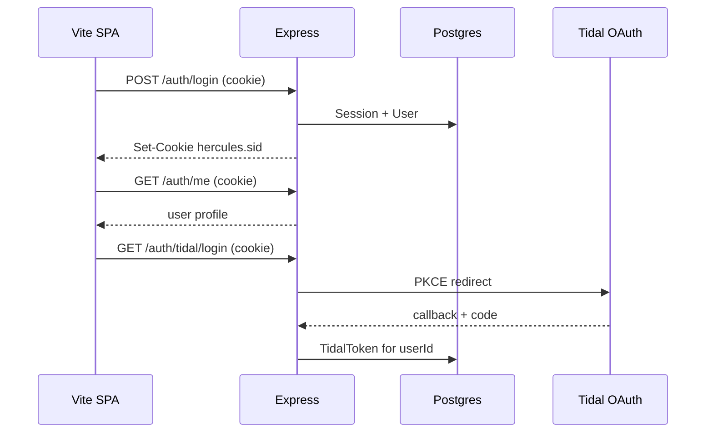

# Tidal backend + practice deck v2 (parallel dispatch)

> **Superseded:** See [hercules-master-roadmap.md](./hercules-master-roadmap.md) for the current integrated plan (auth, Tidal, labs, Wave 5 integration).

## Locked decisions

- **Remove user file upload** — delete `importUserTrack`, file inputs, session `userTracks`, Import BPM UI (`src/audio/tracks.ts`, `TrackPickerBar.tsx`, `useTurntableSession.ts`, `public/tracks/README.md`).
- **Keep bundled + synth fallback** for labs that need full EQ/filter/XF on the turntable (`src/audio/turntable.ts`).
- **Tidal playback is not “fetch manifest → decode in turntable.”** TIDAL requires the official **Player SDK** for audio bytes (DRM). Plan is **hybrid**:
  - **Labs (graded EQ/XF/blend):** bundled loops + synth until/unless Player SDK exposes routable audio.
  - **Catalog UX:** Tidal search + “Connect Tidal” via backend; listening/metadata from API; playback via Player SDK embed or sidecar (Phase 3 spike defines exact UX).
- **No unofficial stream proxies** (hifi-api-style) — ToS/account risk; not in scope.

---

## Auth model (two layers)

**Layer 1 — Hercules app auth (primary)**  
Pattern aligned with cookie-session apps like [jantznick/api-security](https://github.com/jantznick/api-security) (private): **HttpOnly session cookie**, not JWT in `localStorage`.

| Method | Flow |
|--------|------|
| **Username + password** | `POST /auth/login` → verify bcrypt hash → set session cookie |
| **Register** | `POST /auth/register` (email + username + password) → session cookie |
| **Magic link** | `POST /auth/magic-link` (email) → email single-use token → `GET /auth/magic-link/verify?token=` → session cookie |

Session storage: **server-side** row in `Session` table (id, userId, expiresAt) referenced by signed cookie `hercules.sid`. Rotate on login; invalidate on logout.

Security defaults:
- `httpOnly`, `secure` in prod, `sameSite: lax`
- Magic tokens: random 32+ bytes, **store SHA-256 hash only**, TTL 15 min, single-use (`usedAt`)
- Password: bcrypt (cost 12)
- Rate limit magic-link + login by IP/email
- CSRF: same-site cookie + `POST` only for mutations; optional `X-Requested-With` for SPA

**Layer 2 — Tidal OAuth (optional, per user)**  
Only after Layer 1 login. Links `TidalToken` to `User.id`. Tidal refresh tokens encrypted at rest (app-level AES key from env). Frontend never sees Tidal secrets.



**Frontend:** minimal `/login` page (or modal from Settings): email/password **or** “Email me a link”. All `fetch('/api/...')` uses `credentials: 'include'`. Vite dev proxy forwards cookies.

**Reference when implementing T1:** If you have local access to `api-security/backend`, port session middleware + magic-link routes; adapt Prisma models below instead of whatever ORM that repo uses.

---

## Repo layout (new)

```
hercules/
  src/                    # existing frontend
  src/pages/LoginPage.tsx # new (Phase 2 auth UI)
  apps/api/
    src/index.ts
    src/routes/auth.ts      # login, register, logout, magic-link, /me
    src/routes/tidal.ts     # search, connect (requires session)
    src/middleware/session.ts
    src/lib/magicLink.ts
    src/lib/tidal.ts
  prisma/
    schema.prisma
  docker-compose.yml
  .env.example
```

Root scripts: `dev:api`, `dev:all`, `db:migrate`.

---

## Prisma schema (initial)

```prisma
model User {
  id           String    @id @default(cuid())
  email        String    @unique
  username     String    @unique
  passwordHash String?   // null if magic-link-only account
  createdAt    DateTime  @default(now())
  sessions     Session[]
  tidal        TidalToken?
}

model Session {
  id        String   @id @default(cuid())
  userId    String
  user      User     @relation(fields: [userId], references: [id], onDelete: Cascade)
  expiresAt DateTime
  createdAt DateTime @default(now())
}

model MagicLinkToken {
  id        String    @id @default(cuid())
  email     String
  tokenHash String    @unique
  expiresAt DateTime
  usedAt    DateTime?
  createdAt DateTime  @default(now())
}

model TidalToken {
  id           String   @id @default(cuid())
  userId       String   @unique
  user         User     @relation(fields: [userId], references: [id], onDelete: Cascade)
  accessToken  String   // encrypted
  refreshToken String   // encrypted
  expiresAt    DateTime
  updatedAt    DateTime @updatedAt
}

model PracticeTrack {
  id           String  @id @default(cuid())
  tidalTrackId String? @unique
  title        String
  bpm          Int?
  sortOrder    Int     @default(0)
}
```

---

## Parallel streams — Phase 1 (no cross-deps)

| Stream | Owns | Deliverable |
|--------|------|-------------|
| **S0 Security** | tracks.ts, TrackPickerBar, useTurntableSession, README | No upload; login-gated “Connect Tidal” stub |
| **T1 Backend scaffold** | apps/api/*, prisma/*, docker-compose | Express + Postgres + **Session auth skeleton** (login/register/logout/me); magic-link routes stubbed with console log in dev |
| **P1 Phrase timing** | timingFeedback.ts, BlendPracticeLab | Bar-aware blend windows |
| **P2 Beatmatch lab** | BeatmatchPracticeLab.tsx, `/labs/beatmatch` | Learn + HW tempo/jog tips |
| **P3 Global Arm** | Layout / HardwareArmContext | One Arm MIDI+audio in shell |
| **P4 Bundled loops** | public/tracks/*, tracks.ts | CC0 pairs for blend/beatmatch |

**Ownership:** S0 must not touch `apps/api`. P1–P4 must not touch backend.

---

## Phase 2 — App auth UI + Tidal connect (depends T1)

| Stream | Deliverable |
|--------|-------------|
| **A2 Auth UI** | LoginPage, Settings account section, `credentials: 'include'` API client, route guard for Tidal features (“Sign in to search tracks”) |
| **A2b Magic link prod** | Nodemailer (or Resend) + real email in `.env`; dev mode prints link to console |
| **T2 Tidal OAuth** | `GET /auth/tidal/login`, callback, `GET /api/tidal/search` — **all require session cookie** |

---

## Phase 3 — Playback (depends T2)

**T3:** Tidal Player SDK spike → `docs/tidal-playback.md`. MVP picker + Player sidecar; turntable EQ on bundled bed.

---

## Dispatch order

```
T1  Parallel: S0, T1, P1, P2, P3, P4
T2  After T1: A2 Auth UI + A2b magic email + T2 Tidal (can split 2 agents)
T3  After T2: T3
T4  Integration pass
```

---

## Done when

- No file upload
- Register / login / logout / magic link work with HttpOnly cookie
- `/auth/me` returns user; Tidal routes 401 without session
- Connect Tidal + search (metadata) for logged-in users
- Player spike documented
- Practice streams (phrase timing, beatmatch, global Arm, bundled loops) shipped
