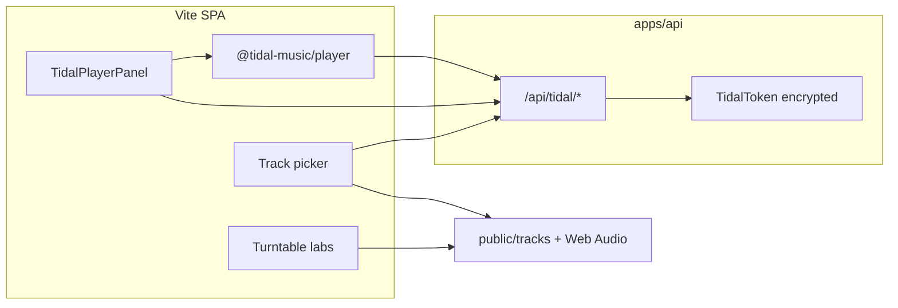

# Tidal playback (hybrid model)

Hercules practice labs need **full Web Audio routing** (EQ, filter, crossfader, waveforms, grading). Tidal streams are **DRM-protected** and may only be decoded through TIDAL’s official **Player SDK** (`@tidal-music/player`). Those two paths do not merge into one turntable graph today.

This document locks the **hybrid** approach used across labs, search, and reference listening.

---

## Two audio paths

| Path | Source | Used for |
|------|--------|----------|
| **Turntable bed** | Bundled CC0 loops in `public/tracks/` (+ synth fallback) | Graded labs: blend, beatmatch, EQ/XF, free play, hot-cue drills |
| **Tidal reference** | Player SDK streamed bytes (Shaka/browser player) | Hear the real track; title/BPM/metadata from Open API |

**Do not** fetch manifests or stream URLs and pipe them into `AudioContext.decodeAudioData` or the turntable engine. Unofficial proxies violate TIDAL ToS and will not reliably decode DRM.

---

## What Tidal is for in Hercules

1. **Reference listening** — sidecar player (`TidalPlayerPanel`) while you practice on bundled beds.
2. **Catalog metadata** — search, title, artist, album, duration, **BPM** via backend Open API (`GET /api/tidal/search`, `GET /api/tidal/tracks/:id`). Backend calls TIDAL `GET /v2/searchResults?filter[query]=…&countryCode=…` (not `/searchResults/{query}` — path `{id}` is an opaque result id).
3. **Track identity** — associate a lab session with a Tidal track id for display; the **audio engine still loads the bundled bed** (T2 picker).
4. **Free Play** — per-deck Tidal search on `/labs/free`, deck labels (title/artist/BPM), and in-lab **Play reference** via Player SDK (`FreePlayTidalReference`).

Tidal is **not** a drop-in replacement for turntable buffers until/unless the Player SDK exposes routable PCM or a mixable output node.

---

## Architecture

- **Layer 1:** Hercules session cookie (`connect.sid`) — all `/api/tidal/*` routes use `requireAuth`.
- **Layer 2:** Per-user `TidalToken` (PKCE OAuth, encrypted at rest). Refresh happens server-side.
- **Player bridge:** `GET /api/tidal/player-session` returns `{ clientId, accessToken, expiresAt }` for the logged-in user so the browser Player SDK can call `setCredentialsProvider` without storing Tidal secrets in `localStorage`.

Tokens are short-lived and session-gated; the frontend never sees the refresh token.

---

## Player SDK spike (T3)

Package: [`@tidal-music/player`](https://github.com/tidal-music/tidal-sdk-web/tree/main/packages/player) (evaluated at v0.20.1).

Minimal integration:

1. `bootstrap({ outputDevices: false, players: [{ itemTypes: ['track'], player: 'shaka' }, { itemTypes: ['track'], player: 'browser' }] })`
2. `setCredentialsProvider({ bus, getCredentials })` — `getCredentials` calls `/api/tidal/player-session`.
3. `load({ productId, productType: 'track', sourceId: 'hercules', sourceType: 'reference' })` then `play()`.
4. Audio renders via SDK `HTMLMediaElement` (sidecar `<audio>`), **not** the turntable graph.

Implementation: `src/components/TidalPlayerPanel.tsx` (Settings) and `src/components/FreePlayTidalReference.tsx` (Free Play). Shared bootstrap: `src/tidal/playerSdk.ts`.

### Spike findings

| Topic | Status |
|-------|--------|
| Official SDK on npm | Yes — `@tidal-music/player@0.20.1` |
| DRM / playback | Requires SDK; no raw URL in Web Audio |
| Credentials | Server-stored OAuth; bridge endpoint for `getCredentials` |
| Routable Web Audio tap | **Not available** in spike — sidecar `<audio>` only |
| HTTPS | TIDAL dev demos use `https://dev.tidal.com`; production Hercules should serve HTTPS |
| Event telemetry | SDK supports `setEventSender` (@tidal-music/event-producer); omitted in spike |

---

## Lab behavior (unchanged)

- **Blend / beatmatch / EQ labs:** deck selects may show a Tidal track label, but **playback and grading use the bundled bed** at matching BPM.
- **Waveforms and mix coach:** derived from bundled buffers, not Tidal streams.
- **Free Play:** Tidal title/artist/BPM appear on the deck UI; **Play reference** streams via Player SDK. Pads/EQ/waveforms remain on the practice bed (hybrid note in UI).
- **Settings reference player:** optional search + play sidecar.

---

## Out of scope

- Unofficial stream proxies or manifest scraping
- Replacing bundled beds with Tidal audio in graded labs
- Offline / download (Player offline engine)
- Spotify / Apple Music
- Routing Player SDK output into the crossfader

---

## OAuth (Connect Tidal)

Flow: Settings → `apiHref("/tidal/login")` (API host) → PKCE authorize at `https://login.tidal.com/authorize` → `GET /api/tidal/callback` → redirect to SPA `/settings`.

| Item | Value |
|------|--------|
| Authorize | `https://login.tidal.com/authorize` |
| Token | `https://auth.tidal.com/v1/oauth2/token` |
| Default scopes | `search.read playback` (override with `TIDAL_SCOPES`) |
| Redirect URI (prod) | `https://api.hercules.nickjantz.com/api/tidal/callback` |
| Catalog country | `TIDAL_COUNTRY_CODE` (ISO 3166-1 alpha-2, default `US`) — passed on search/track Open API calls |

Register the redirect URI **exactly** in the [developer dashboard](https://developer.tidal.com/dashboard) and enable the same scopes. Do **not** request legacy `r_usr` / `w_usr` — they commonly produce authorize **Error 1002** (`invalid_scope` / `unauthorized_client`). Params like `geo` and `campaignId` on Tidal’s error page are added by their login UI, not by Hercules.

---

## Related files

- Backend OAuth + search: `apps/api/src/routes/tidal.ts`, `apps/api/src/lib/tidal.ts`
- Frontend API: `src/api/client.ts` (`apiHref` for Connect)
- Sidecar UI: `src/components/TidalPlayerPanel.tsx`, `src/components/FreePlayTidalReference.tsx`
- Player bootstrap: `src/tidal/playerSdk.ts`
- Bundled catalog: `src/audio/tracks.ts`, `public/tracks/README.md`
- Deploy env: `docs/RAILWAY.md`, `.env.example`
- Master plan: `docs/plans/hercules-master-roadmap.md`
